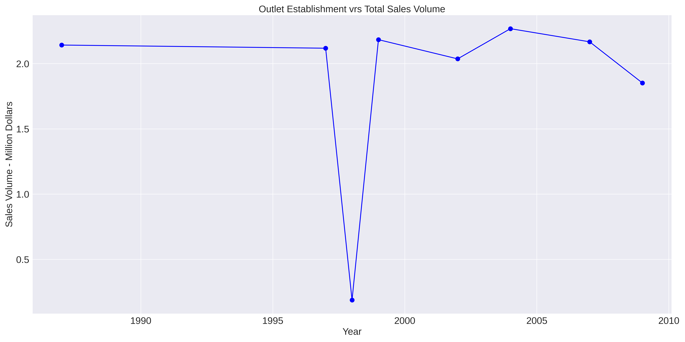
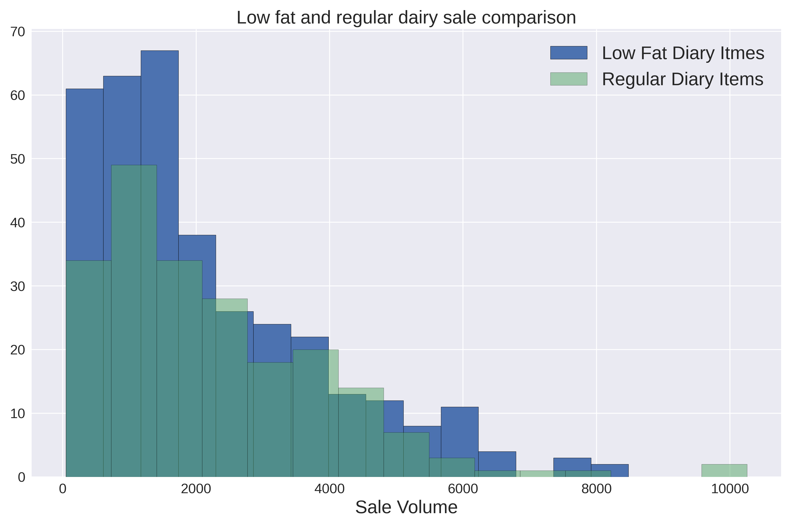
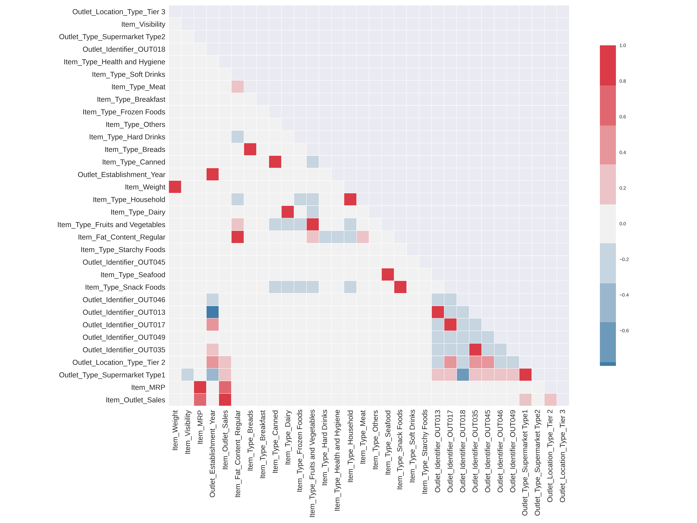
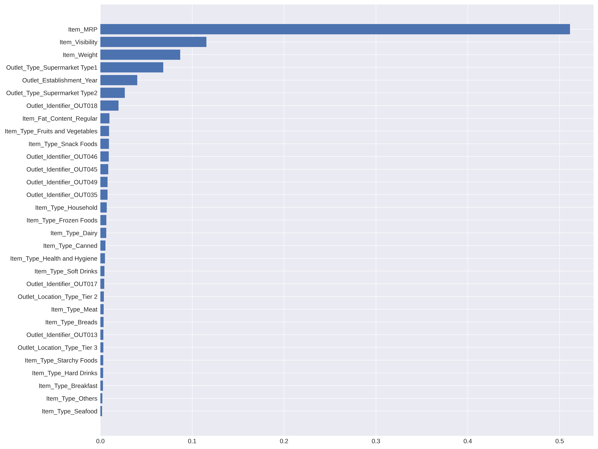

# Sales_Predictions_Project

Predict sale volume based on several features.

The first image shows the total sales based on the establishment of the outlet. This shows that the oldest establishment has the largest sale - with the exception of the anomaly in the middle 

This second plot shots the volume of sale of regular vrs low fat dairy products 

This correlation plot shows the features that are most important to the model. The correlation plot shows that of all the features that were used in the model, the most important were price of items, location of the store, item weight and item visibility 

The linear regression model was able to predict the sale volume with a 50% accuracy whilst the randomforest tree predicted with 47% accuracy. Both scores were R squared regression matrices which which predicts the proportion of the variation in sales that is explained by features.

This last 2 plots show the features that are most important to the models used. 

